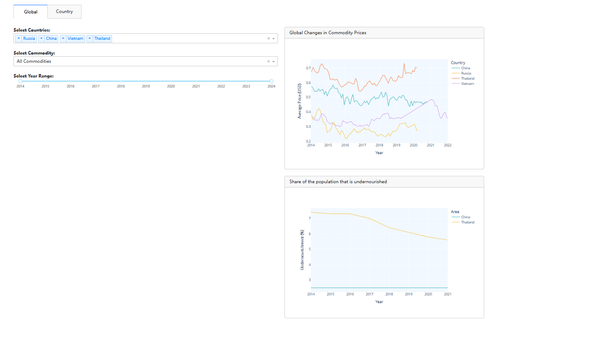
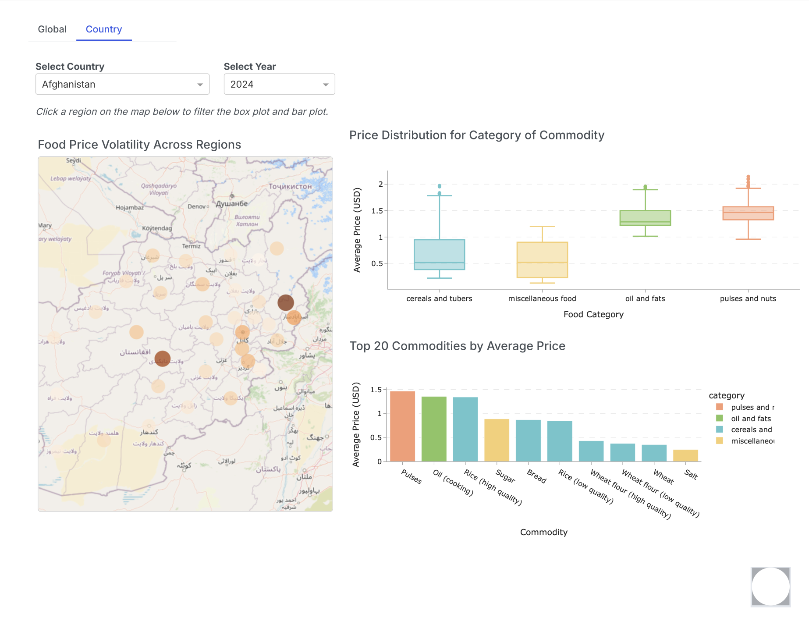

# Food Security Dashboard

This dashboard provides insights into global food security by monitoring key metrics in developing countries, including food prices, affordability, and undernourishment. By visualizing data across time and location, users can easily pinpoint areas that may require additional support and prioritize commodities for aid programs.

**The Global Tab** presents an overview of food pricing and malnutrition trends. Line charts display the average food price (in USD) and undernourishment index over time. Users can select countries from a dropdown menu to compare data across multiple countries. Another dropdown menu allows users to choose specific food categories between viewing essential commodities only or all commodities. Users can also adjust a time slider to display data changes within a specific year range. Any changes made automatically update the plots. Line charts provide additional details on hover.

**The Country Tab** helps users identify regions within a selected country that require the most assistance and determine which commodities exhibit significant price instability. Users can select a country and a year from a dropdown menu, prompting the display of a country map with circles sized according to average commodity prices. Box plots show the distribution of commodity prices, while bar plots rank commodities from highest to lowest. Clicking a region on the map updates the plots to reflect the selected area's data.

By interacting with the dashboard, users can explore food security visualizations and metrics across countries, detect trends, and support data-driven decisions to enhance food aid programs.

Dashboard output

