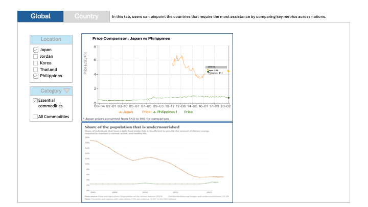
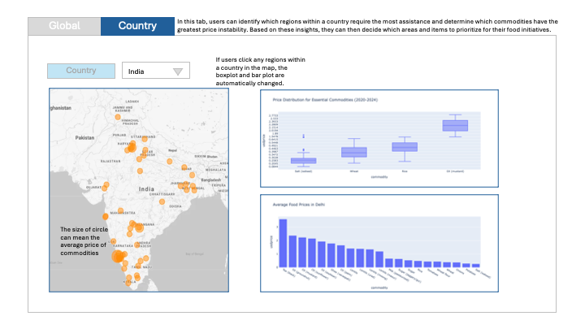

# Food Security Dashboard

The dashboard provides insights into global food security by monitoring food prices, affordability, and undernourishment in developing countries.

**The Global Tab** presents an overview of food pricing and malnutrition trends. Line charts display the average food price and undernourishment index over time, allowing users to compare multiple countries by selecting checkboxes. A dropdown menu lets users choose specific food categories, and any changes made automatically update the plots. Line charts provide additional details on hover.

**The Country Tab** helps users identify regions within a selected country that require the most assistance and determine which commodities exhibit significant price instability. Users can select a country from a dropdown menu, prompting the display of a country map with circles sized according to average commodity prices. Box plots show the distribution of commodity prices, while bar plots rank commodities from highest to lowest. Clicking a region on the map updates the plots to reflect the selected area's data.

By interacting with the dashboard, users can explore food security visualizations and metrics across countries, detect trends, and support data-driven decisions to enhance food aid programs.

Example sketch

